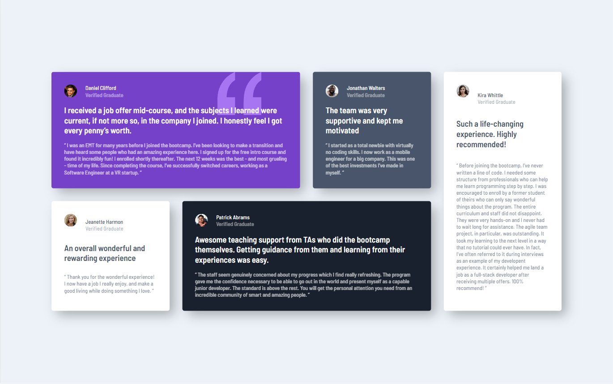

# Frontend Mentor - Testimonials grid section solution

This is a solution to the [Testimonials grid section challenge on Frontend Mentor](https://www.frontendmentor.io/challenges/testimonials-grid-section-Nnw6J7Un7). Frontend Mentor challenges help you improve your coding skills by building realistic projects. 

## Table of contents

- [Overview](#overview)
  - [The challenge](#the-challenge)
  - [Screenshot](#screenshot)
  - [Links](#links)
- [My process](#my-process)
  - [Built with](#built-with)
  - [What I learned](#what-i-learned)
  - [Useful resources](#useful-resources)
- [Author](#author)


## Overview

### The challenge

Users should be able to:

- View the optimal layout for the site depending on their device's screen size

### Screenshot



### Links

- Solution URL: (https://www.frontendmentor.io/solutions/testimonialsgridsectionmain-Z5VGsmPhMw)
- Live Site URL: (https://jallanoli.github.io/testimonials-grid-section-main/)

## My process

### Built with

- Semantic HTML5 markup
- CSS custom properties
- Flexbox
- CSS Grid
- Mobile-first workflow

### What I learned


```html
Really liked the structural choices to make the articles:
<article class="card daniel span-2">
      <div class="info">
        
        <div class="person">
          <p class="name">Daniel Clifford</p>
          <p class="att">Verified Graduate</p>
        </div>
      </div>
      <div class="content">
        <h1>I received a job offer mid-course, and the subjects I learned were current, if not more so, in the company I
          joined. I honestly feel I got every penny’s worth.</h1>
        <p class="comment">“ I was an EMT for many years before I joined the bootcamp. I’ve been looking to make a
          transition and have heard some people who had an amazing experience here. I signed up
          for the free intro course and found it incredibly fun! I enrolled shortly thereafter.
          The next 12 weeks was the best - and most grueling - time of my life. Since completing
          the course, I’ve successfully switched careers, working as a Software Engineer at a VR startup. ”</p>
      </div>
    </article>
```
```css
On the CSS the best learnin was on making the grid responsive:
@media (min-width: 600px) {
    .main-content {
        grid-template-columns: repeat(2, 1fr);
    }
    
    .daniel, .pat, .kira {
        grid-column: span 2;
    }
}

@media (min-width: 800px) {
    .main-content {
        grid-template-columns: repeat(3, 1fr);
    }
    .kira {
        grid-column: span 3;
    }
}

@media (min-width: 1200px) {
    body {
        padding: 0;
        min-height: 100vh;
        display: flex;
        justify-content: center;
        align-items: center;
    }

    .main-content {
        max-width: 1200px;
        grid-template-columns: repeat(4, 1fr);
    }

    .span-2 {
        grid-column: span 2;
    }

    .kira {
        grid-column: 4;
        grid-row: 1 / 3;
    }

    .daniel {
        background-position-x: 390px;
    }
}
```

### Useful resources

- [Grid snippet](https://css-tricks.com/snippets/css/complete-guide-grid/) - Really helped with the grid properties. 
- [Shadow generator](https://html-css-js.com/css/generator/box-shadow/) - This one always helps with css shadows


## Author

- Frontend Mentor - [@jAllanOli](https://www.frontendmentor.io/profile/jAllanOli)
